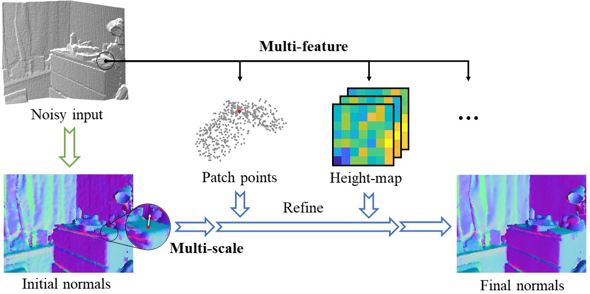
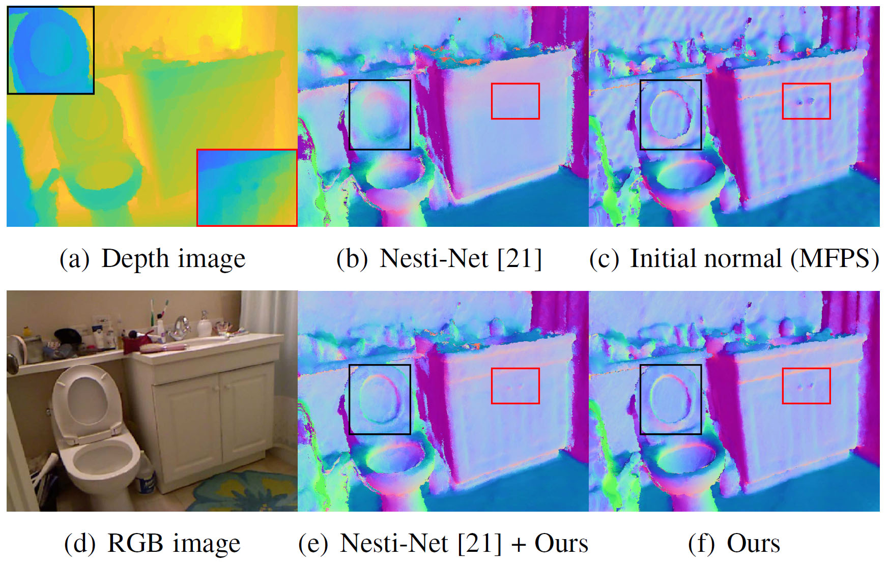

# Refine-Net: Normal Refinement Neural Network for Noisy Point Clouds

This repository contains pytorch implementation for **RefineNet**: Refine-Net: Normal Refinement Neural Network for Noisy Point Clouds (**TPAMI**'2022).

RefineNet presents a normal refinement network for estimating normals in noisy point clouds. This repository contains our network implementation and MPFS initial normal estimation. RefineNet can also be applied on other methods and refine their predicted normals.
If you find our work useful in your research, please cite our paper:

    @article{zhou2022refine,
        title={Refine-Net: Normal Refinement Neural Network for Noisy Point Clouds},
        author={Zhou, Haoran and Chen, Honghua and Zhang, Yingkui and Wei, Mingqiang and Xie, Haoran and Wang, Jun and Lu, Tong and Qin, Jing and Zhang, Xiao-Ping},
        journal={IEEE Transactions on Pattern Analysis and Machine Intelligence},
        year={2022},
        publisher={IEEE}
    }

## Install

* The code has been tested on one configuration:
    - PyTorch == 1.1.0
    - python == 3.7.10
    - CUDA == 10.1
    - scikit-learn

* First, you should compile the C++ extension modules for python located in `cpp_wrappers`. Open a terminal in this folder, and run:

        sh compile_wrappers.sh

## Datasets

The original pcpnet dataset can be downloaded from [here](http://geometry.cs.ucl.ac.uk/projects/2018/pcpnet/pclouds.zip). We also provide our processed dataset and normal results [here](https://drive.google.com/drive/folders/1rbCdYmXfaZ2cRgSZynlfdsoyJUr8keNg?usp=sharing).

Our own synthetic dataset: Coming soon.

## Usage

### Training

Before training, specify your dataset directories in `train.py`:

    cfg.dataset.pointcloud_dir = '<*PATH-TO-YOUR-DATASET*>/pcpnet'

RefineNet takes a set of initial normals as input. You can use your own initial normal results on the training set. Alternatively, we provide our normal input [here](https://drive.google.com/file/d/1SMITQSAk0gtROZqUsRI2LfraYwgcbqkn/view?usp=sharing), or you can use the processed data [here](https://drive.google.com/file/d/1_MDJP3z5pWLRwen4lUnySS8a0kxGPJsm/view?usp=sharing) (with processed features). Place any of these data under:

    cfg.dataset.normal_dir = '<*PATH-TO-NORMALS*>/initial_normals'

To train RefineNet, simply run:

    python3 train.py

### Testing

To test RefineNet, you should provide the pretrained models:

    python3 train.py --test --pretrained <*PATH-TO-PRETRAINED*>

For example, the default path for pretrained models is `./results/train`:

    python3 train.py --test --pretrained train

### Initial Normal Estimation

Our initial normal estimator (MFPS) is implemented in `./matlab`. Simply run `./matlab/RUN.m` to compute initial normals for each input point cloud. Matlab >= 2018b is required.

To use your own dataset, simply change the data path in `./matlab/RUN.m`:

    path_pointcloud = '<*PATH-TO-YOUR-DATASET*>';

### Some Results

## 🔥Update
* 2022-03-18: Initial Update.

## Acknowledgment

This work is partly based on our previous cvpr20 [paper](https://github.com/hrzhou2/NH-Net-master).

Some of the code is borrowed from [pcpnet](https://github.com/paulguerrero/pcpnet). We thank the authors for their excellent work.

